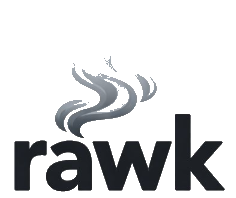

# rawk

A **R**ust implementation of **AWK** with the goal of achieving POSIX compatibility. 

  

     
  

## Resources

* [POSIX specification](https://pubs.opengroup.org/onlinepubs/9699919799/utilities/awk.html)
* [GoAWK, an AWK interpreter written in Go](https://benhoyt.com/writings/goawk/) - The inspiration for making rawk.
* [goawk](https://github.com/benhoyt/goawk) - The repository for the GoAWK implementation
* [The One True Awk](https://github.com/onetrueawk/awk) - This is the version of awk described in _The AWK Programming Language_, Second Edition, by Al Aho, Brian Kernighan, and Peter Weinberger (Addison-Wesley, 2024, ISBN-13 978-0138269722, ISBN-10 0138269726).